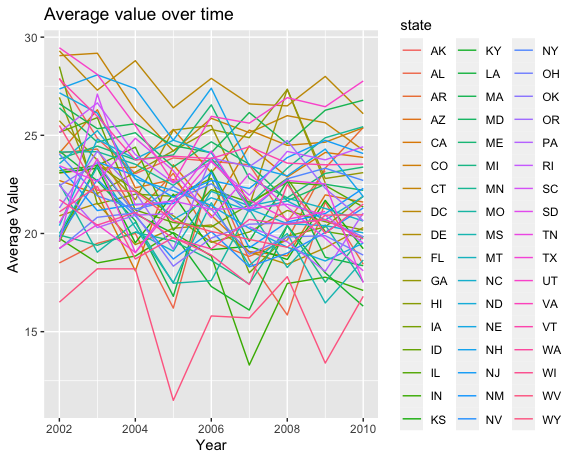

p8105\_hw3\_kz2411
================
Keming Zhang
10/15/2021

## Problem 1

``` r
#load data for problem 1
data("instacart")
```

### a)

``` r
#group by aisle_id, calculate the number of each aisle and order them according to number.
group_by_aisles <- instacart %>%
  janitor::clean_names() %>%
  group_by(aisle) %>%
  summarize(n_obs = n()) %>%
  arrange(desc(n_obs))

#the number of aisle
nrow(group_by_aisles)
```

    ## [1] 134

``` r
#the most aisle
head(group_by_aisles,2)
```

    ## # A tibble: 2 × 2
    ##   aisle             n_obs
    ##   <chr>             <int>
    ## 1 fresh vegetables 150609
    ## 2 fresh fruits     150473

There are 134 aisles, and fresh vegetables are the most items ordered
from. It shows that people can order many categories of things online
and fresh vegetables are the most. It is reasonable, for now online
shopping is convenient and fresh vegetables are necessities.

### b)

``` r
#arrange and plot
group_by_aisles %>%
  filter(n_obs > 10000) %>% #more than 10000
  arrange(desc(n_obs)) %>%
  #convert char to factor for x axis uses the alphabetical order when ggplot
  mutate(
    aisle = as_factor(aisle)
  ) %>%
  ggplot(aes(x = aisle, y = n_obs)) +
  geom_point() + 
  labs(
    title = "The number of items ordered in each aisle",
    x = "Aisles",
    y = "Number"
  ) +
  theme(axis.text.x = element_text(angle = 270))
```

<!-- -->

The plot shows that the number of fresh vegetables and fresh fruits is
far greater than other aisles, nearly at least two times number of other
aisles.

### c)

``` r
#create a table for three popular items
three_items_table <- instacart %>%
  janitor::clean_names() %>%
  filter(aisle %in% c("baking ingredients","dog food care","packaged vegetables fruits")) %>%
  group_by(product_id) %>%
  summarize(
    product_id,
    product_name,
    product_num = n(), #number of the product
    aisle
  ) %>%
  distinct() %>%
  group_by(aisle) %>%
  arrange(desc(product_num)) %>%
  top_n(3,product_num) #select top 3 of each aisle
```

    ## `summarise()` has grouped output by 'product_id'. You can override using the `.groups` argument.

``` r
three_items_table
```

    ## # A tibble: 9 × 4
    ## # Groups:   aisle [3]
    ##   product_id product_name                        product_num aisle              
    ##        <int> <chr>                                     <int> <chr>              
    ## 1      21903 Organic Baby Spinach                       9784 packaged vegetable…
    ## 2      27966 Organic Raspberries                        5546 packaged vegetable…
    ## 3      39275 Organic Blueberries                        4966 packaged vegetable…
    ## 4      23537 Light Brown Sugar                           499 baking ingredients 
    ## 5      23405 Pure Baking Soda                            387 baking ingredients 
    ## 6      49533 Cane Sugar                                  336 baking ingredients 
    ## 7        722 Snack Sticks Chicken & Rice Recipe…          30 dog food care      
    ## 8      23329 Organix Chicken & Brown Rice Recipe          28 dog food care      
    ## 9      17471 Small Dog Biscuits                           26 dog food care

Among three aisles, people buy the packaged vegetables fruits most,
followed by baking ingredients and the least dog food care. And there is
about one order of magnitude among them. It is reasonable, for vegetable
fruits are necessities.

### d)

``` r
#create a table of mean hour
mean_hour_table <- instacart %>%
  filter(product_name %in% c("Pink Lady Apples","Coffee Ice Cream")) %>%
  group_by(product_name,order_dow) %>%
  summarize(
    mean_hour = mean(order_hour_of_day)
  ) %>%
  pivot_wider(
    names_from = order_dow,
    values_from = mean_hour
  ) %>%
  # use 0 - 6 as Sunday - Saturday
  rename(sunday = "0", monday = "1", tuesday = "2", wednesday = "3",
         thursday = "4", friday = "5", saturday = "6") %>%
  janitor::clean_names()
```

    ## `summarise()` has grouped output by 'product_name'. You can override using the `.groups` argument.

``` r
mean_hour_table %>% knitr::kable(digits = 1)
```

| product\_name    | sunday | monday | tuesday | wednesday | thursday | friday | saturday |
|:-----------------|-------:|-------:|--------:|----------:|---------:|-------:|---------:|
| Coffee Ice Cream |   13.8 |   14.3 |    15.4 |      15.3 |     15.2 |   12.3 |     13.8 |
| Pink Lady Apples |   13.4 |   11.4 |    11.7 |      14.2 |     11.6 |   12.8 |     11.9 |

From the table, we can that people order coffee\_ice\_cream mainly in
the afternoon no matter what day it is. People order pink lady apples
mainly at noon.

## Problem 2

``` r
#load data for problem 2
data("brfss_smart2010")
```

``` r
#clean the data
brfss_data <- brfss_smart2010 %>%
  janitor::clean_names() %>%
  rename(state = locationabbr, location = locationdesc) %>% #rename locationabbr and locationdesc
  filter(topic == "Overall Health") %>%
  filter(response %in% c("Poor","Fair","Good","Very good","Excellent")) %>%
  mutate(
    response = factor(response, levels = c("Poor","Fair","Good","Very good","Excellent"))
  )

brfss_data
```

    ## # A tibble: 10,625 × 23
    ##     year state location   class  topic question  response sample_size data_value
    ##    <int> <chr> <chr>      <chr>  <chr> <chr>     <fct>          <int>      <dbl>
    ##  1  2010 AL    AL - Jeff… Healt… Over… How is y… Excelle…          94       18.9
    ##  2  2010 AL    AL - Jeff… Healt… Over… How is y… Very go…         148       30  
    ##  3  2010 AL    AL - Jeff… Healt… Over… How is y… Good             208       33.1
    ##  4  2010 AL    AL - Jeff… Healt… Over… How is y… Fair             107       12.5
    ##  5  2010 AL    AL - Jeff… Healt… Over… How is y… Poor              45        5.5
    ##  6  2010 AL    AL - Mobi… Healt… Over… How is y… Excelle…          91       15.6
    ##  7  2010 AL    AL - Mobi… Healt… Over… How is y… Very go…         177       31.3
    ##  8  2010 AL    AL - Mobi… Healt… Over… How is y… Good             224       31.2
    ##  9  2010 AL    AL - Mobi… Healt… Over… How is y… Fair             120       15.5
    ## 10  2010 AL    AL - Mobi… Healt… Over… How is y… Poor              66        6.4
    ## # … with 10,615 more rows, and 14 more variables: confidence_limit_low <dbl>,
    ## #   confidence_limit_high <dbl>, display_order <int>, data_value_unit <chr>,
    ## #   data_value_type <chr>, data_value_footnote_symbol <chr>,
    ## #   data_value_footnote <chr>, data_source <chr>, class_id <chr>,
    ## #   topic_id <chr>, location_id <chr>, question_id <chr>, respid <chr>,
    ## #   geo_location <chr>

### a)

``` r
#in 2002
num_in_2002 <- brfss_data %>%
  filter(year == 2002) %>%
  distinct(state,location) %>%
  group_by(state) %>%
  summarize(
    num = n()
  ) %>%
  filter(num >= 7)

#in 2010
num_in_2010 <- brfss_data %>%
  filter(year == 2010) %>%
  distinct(state,location) %>%
  group_by(state) %>%
  summarize(
    num = n()
  ) %>%
  filter(num >= 7)
```

In 2002, the result is as below.

``` r
num_in_2002 %>% knitr::kable(digits = 1)
```

| state | num |
|:------|----:|
| CT    |   7 |
| FL    |   7 |
| MA    |   8 |
| NC    |   7 |
| NJ    |   8 |
| PA    |  10 |

In 2010, the result is as below.

``` r
num_in_2010 %>% knitr::kable(digits = 1)
```

| state | num |
|:------|----:|
| CA    |  12 |
| CO    |   7 |
| FL    |  41 |
| MA    |   9 |
| MD    |  12 |
| NC    |  12 |
| NE    |  10 |
| NJ    |  19 |
| NY    |   9 |
| OH    |   8 |
| PA    |   7 |
| SC    |   7 |
| TX    |  16 |
| WA    |  10 |

### b)

``` r
#dataset limit to excellent
brfss_excellent <- brfss_data %>%
  filter(response == "Excellent") %>%
  group_by(year,state,response) %>%
  summarize(
    mean_value = mean(data_value) 
  )
```

    ## `summarise()` has grouped output by 'year', 'state'. You can override using the `.groups` argument.

``` r
brfss_excellent
```

    ## # A tibble: 443 × 4
    ## # Groups:   year, state [443]
    ##     year state response  mean_value
    ##    <int> <chr> <fct>          <dbl>
    ##  1  2002 AK    Excellent       27.9
    ##  2  2002 AL    Excellent       18.5
    ##  3  2002 AR    Excellent       24.1
    ##  4  2002 AZ    Excellent       24.1
    ##  5  2002 CA    Excellent       22.7
    ##  6  2002 CO    Excellent       23.1
    ##  7  2002 CT    Excellent       29.1
    ##  8  2002 DC    Excellent       29.3
    ##  9  2002 DE    Excellent       20.9
    ## 10  2002 FL    Excellent       25.7
    ## # … with 433 more rows

``` r
#create a spaghetti plot
ggplot(brfss_excellent, aes(x = year, y = mean_value, group = state)) +
  geom_line(aes(color = state),na.rm = TRUE) +
  labs(
    title = "Average value over time",
    x = "Year",
    y = "Average Value"
  )
```

<!-- -->

### c)

``` r
#plot for NY
#data for plot
ny_data <- brfss_data %>%
  filter(state == "NY" & (year == 2006 | year == 2010))

#plot
ggplot(ny_data,aes(x = response, y = data_value)) + 
  geom_violin() +
  theme(axis.text.x = element_text(angle = 270)) +
  labs(
    title = "Distribution of data_value for responses",
    x = "Response Type",
    y = "Value"
  ) +
  facet_grid(.~year)
```

<!-- -->

## Problem 3

### a)

``` r
#load data and wrangle
accelerometer_data <- read_csv(file = './data/accelerometer.csv',
                            show_col_types = FALSE) %>%
  janitor::clean_names() %>%
  #turn table from wide to long and rename
  pivot_longer(
    activity_1:activity_1440,
    names_to = "minute",
    names_prefix = "activity_",
    values_to = "activity"
  ) %>%
  mutate(
    #decide whether the day is a weekend day or not
    day_kind = ifelse(day %in% c("Monday","Tuesday","Wednesday","Thursday","Friday"),0,1),
    day_kind = as.factor(day_kind),
    minute = as.numeric(minute)
  )

head(accelerometer_data,1) #check whether data is with reasonable variable classes
```

    ## # A tibble: 1 × 6
    ##    week day_id day    minute activity day_kind
    ##   <dbl>  <dbl> <chr>   <dbl>    <dbl> <fct>   
    ## 1     1      1 Friday      1     88.4 0

``` r
accelerometer_data
```

    ## # A tibble: 50,400 × 6
    ##     week day_id day    minute activity day_kind
    ##    <dbl>  <dbl> <chr>   <dbl>    <dbl> <fct>   
    ##  1     1      1 Friday      1     88.4 0       
    ##  2     1      1 Friday      2     82.2 0       
    ##  3     1      1 Friday      3     64.4 0       
    ##  4     1      1 Friday      4     70.0 0       
    ##  5     1      1 Friday      5     75.0 0       
    ##  6     1      1 Friday      6     66.3 0       
    ##  7     1      1 Friday      7     53.8 0       
    ##  8     1      1 Friday      8     47.8 0       
    ##  9     1      1 Friday      9     55.5 0       
    ## 10     1      1 Friday     10     43.0 0       
    ## # … with 50,390 more rows

There are 50400 observations and 6 variables exist in the resulting
dataset. The variables are week (numeric), day id (numeric), day
(character), minute (numeric), activity (numeric) and day\_kind
(factor).

### b)

``` r
#create table
aggregate_data <- accelerometer_data %>%
  group_by(week,day_id,day,day_kind) %>%
  summarize(
    activity_sum = sum(activity)
  )
```

    ## `summarise()` has grouped output by 'week', 'day_id', 'day'. You can override using the `.groups` argument.

``` r
#show table
aggregate_data %>% knitr::kable(digits = 1)
```

| week | day\_id | day       | day\_kind | activity\_sum |
|-----:|--------:|:----------|:----------|--------------:|
|    1 |       1 | Friday    | 0         |      480542.6 |
|    1 |       2 | Monday    | 0         |       78828.1 |
|    1 |       3 | Saturday  | 1         |      376254.0 |
|    1 |       4 | Sunday    | 1         |      631105.0 |
|    1 |       5 | Thursday  | 0         |      355923.6 |
|    1 |       6 | Tuesday   | 0         |      307094.2 |
|    1 |       7 | Wednesday | 0         |      340115.0 |
|    2 |       8 | Friday    | 0         |      568839.0 |
|    2 |       9 | Monday    | 0         |      295431.0 |
|    2 |      10 | Saturday  | 1         |      607175.0 |
|    2 |      11 | Sunday    | 1         |      422018.0 |
|    2 |      12 | Thursday  | 0         |      474048.0 |
|    2 |      13 | Tuesday   | 0         |      423245.0 |
|    2 |      14 | Wednesday | 0         |      440962.0 |
|    3 |      15 | Friday    | 0         |      467420.0 |
|    3 |      16 | Monday    | 0         |      685910.0 |
|    3 |      17 | Saturday  | 1         |      382928.0 |
|    3 |      18 | Sunday    | 1         |      467052.0 |
|    3 |      19 | Thursday  | 0         |      371230.0 |
|    3 |      20 | Tuesday   | 0         |      381507.0 |
|    3 |      21 | Wednesday | 0         |      468869.0 |
|    4 |      22 | Friday    | 0         |      154049.0 |
|    4 |      23 | Monday    | 0         |      409450.0 |
|    4 |      24 | Saturday  | 1         |        1440.0 |
|    4 |      25 | Sunday    | 1         |      260617.0 |
|    4 |      26 | Thursday  | 0         |      340291.0 |
|    4 |      27 | Tuesday   | 0         |      319568.0 |
|    4 |      28 | Wednesday | 0         |      434460.0 |
|    5 |      29 | Friday    | 0         |      620860.0 |
|    5 |      30 | Monday    | 0         |      389080.0 |
|    5 |      31 | Saturday  | 1         |        1440.0 |
|    5 |      32 | Sunday    | 1         |      138421.0 |
|    5 |      33 | Thursday  | 0         |      549658.0 |
|    5 |      34 | Tuesday   | 0         |      367824.0 |
|    5 |      35 | Wednesday | 0         |      445366.0 |

There are no apparent trend. On the whole, although the man does more
activities in the weekday than in the weekend, there are some
exceptions.

### c)

``` r
ggplot(accelerometer_data,aes(x = minute / 60, y = activity,color = day)) +
  geom_point() +
  geom_line() +
  scale_x_continuous(
    breaks = c(0, 6,12,18,24), 
    labels = c("00:00", "6:00", "12:00", "18:00", "23:59")
  ) +
  labs(
    title = "24-hour activity time courses for each day",
    x = "Time",
    y = "Acctivity"
  )
```

<!-- -->

The man may sleep from 22:00 to 6:00 for this is the time period when
there are least activities. When it is on the weekend, the man does more
activities at noon than in other time period. When it is on the weekday,
the man does more activities in the evening than in other time period.
